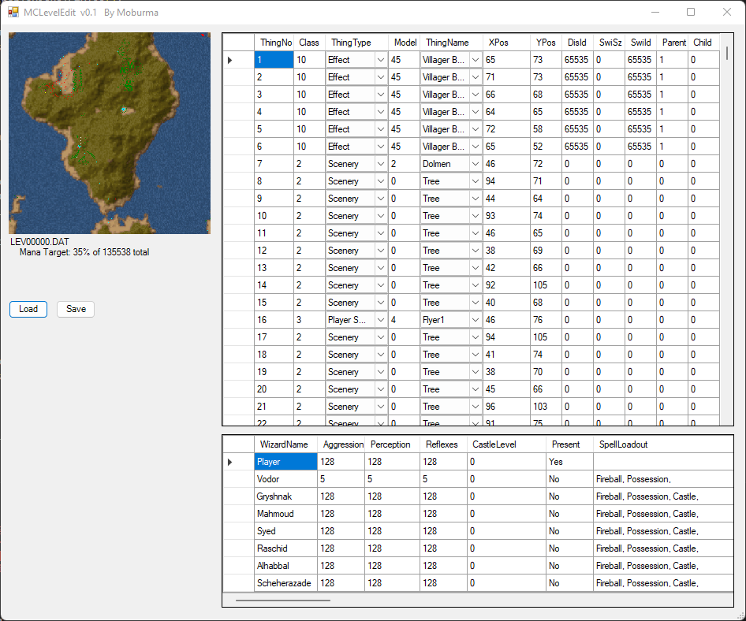

# MCLevelEdit
A simplistic Level Editor for the Bullfrog Productions game Magic Carpet. It's written in PowerShell 5, but will eventually get re-written into C#.

Currently it only works for the original Magic Carpet, but likely works fine for levels from the Hidden Worlds expansion too. It does not work with Magic Carpet 2 levels (yet).

At the moment this is more of a proof of concept release, it is useful mainly for reverse engineering and editing the existing levels. It will eventually support making your own levels from scratch, better support for which should come soon.

## Usage

* You will need the original loose level files. These are NOT included with Magic Carpet Plus, but can be found on the original Magic Carpet CD in the LEVELS directory
* You will need to decompress the levels to edit them. They are RNC compressed and there are many tools available to achieve this, [this](https://github.com/lab313ru/rnc_propack_source) tool is recommended
* Once the above is complete, run the script via the run button from inside PowerShell ISE: MCLevelEdit.PS1
* Choose Load to load one of the extracted and compressed level files above
* Edit levels as you see fit
* When finished press the save button to save a level file. Note this takes a relatively long time (approx 30 seconds) to save, so be patient! You will see a prompt when complete
* To play levels, you must add them RNC pack them, then add them with the other level files to the LEVELS.DAT/TAB file. To do this, see my other script [here](https://github.com/Moburma/MCDatTab)
* Keep in mind that a large number of the game's levels work by only giving the player the spell inventory they have found at that point, and ignore what is set in the level file. If you set your level as the first one in the game, for example, the player will always start with NO spells, regardless what is set in the level file. To work around this, either save as a later "spell vampire" level, include the spells on the ground at map start, or use the Alpha executable found on the original game CD (non-Magic Carpet Plus) for testing

For information on game entities and attributes, see [here](https://tcrf.net/Notes:Magic_Carpet_(DOS)) and [here](https://github.com/michaelhoward/MagicCarpetFileFormat/blob/master/magic%20carpet%20file%20format.txt).

Things placed in a level will appear in the map overview at the top left of the window. The currently highlighted object in the main dataview will appear orange (can be hard to see), so use that to know which object is where. Things like large buildings, craters, and walls just appear as small dots, so what is seen here is not the same as in-game.

Map Key: 
Red - Creature (enemies but also villagers) 
Yellow - Player start (including computer controlled wizards) 
Green - Scenery (includes trees and standing stones) 
Purple - Spells 
Cyan - Effect (things like explosions but also extra map elements like canyons and walls) 
White - Switch (hidden switches) 

## Limitations/Known issues

* Needs to be run from the play button in PowerShell ISE otherwise the map images won't load. Need to fix this.
* The map image support is very crude and only a few levels have map images pre-created. The rest will appear as black squares
* Removed items still appear on the map image
* No editing of Mapgen attributes yet
* No editing of mana total and target yet
* No adding/removing wizards from levels yet

## Todo

* Support for new level creation - exposing Mapgen attributes 
* Support for editing level mana total and mana target
* Support for changing which Wizards are present on a level
* Possibly support for wizard AI functionality
* Mana total estimation 
* Hopefully integration with the [REMC2](https://github.com/thobbsinteractive/magic-carpet-2-hd) project to have proper realtime map view
* Magic Carpet 2 level support
* Make it look nicer
